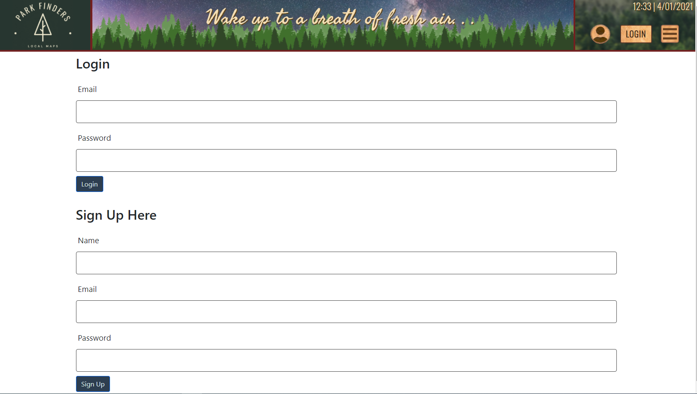
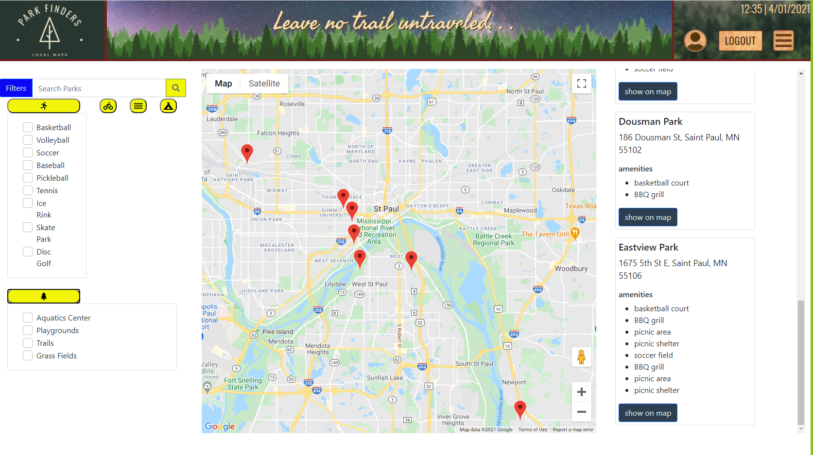

# park_finder_app

 
  * [Installation](#installation)
  * [Usage](#usage)
  * [Contributors](#contributors)

  
  
  ------------------------------------
  
  ## Description
  
  The goal of this project is to have a way to search what activities or amenities are available at a park near you.  For example, if you are looking for a park with a basketball court or would like to got a park with trails, we want you to be able to find that using our app.

  When you first arrive on the main page, you are prompted to either login or if you do not have a login, you will be able to create login credentials.  
  
  

  After successfully logging in, you are met with a map displaying your favorite parks, a sidebar with different search parameters, and your results are displayed with cards on the side of the map.

  

  This app is still a work in progress, but eventually we would like our users to be able to save their favorite parks and also create events at that park so other users can view and add their own community events.
  
  ------------------------------------
  
  ## Installation
  
  To install this application, please enter the following.  
      
      npm install
  
  
  ------------------------------------
  
  ## Usage
  
  This section describes any additional instructions required to use the app. 
  
      You will need to create login credentials before accessing the content of the page

  
  
  ------------------------------------
  
  ## Contributors
  
  This repo was created by **Brandon Norrgard, Bryan Thaoxaochay, Calvin Jacobsen, Noah Schlag, Jim Nguyen**.  
  
  
  

